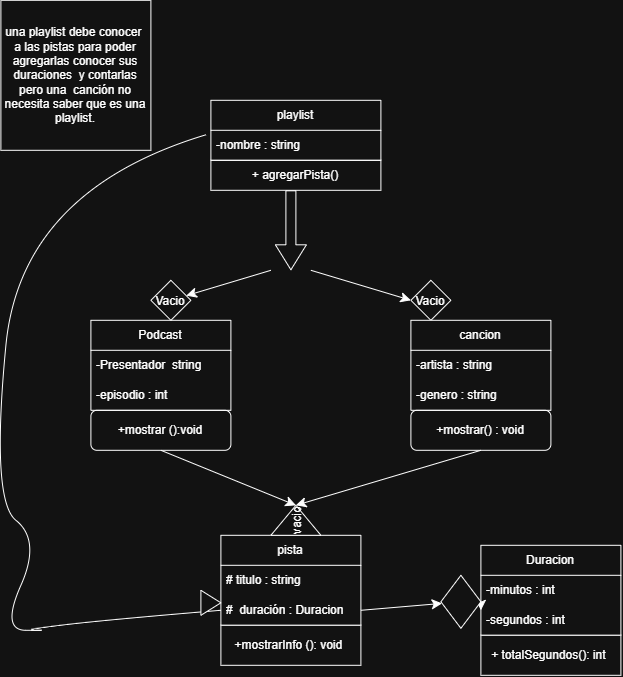

# Práctica 1: Playlist de música

Programación Orientada a Objetos · Ingeniería Mecatrónica · Tercer semestre

Llena cada espacio conforme avances en las fases de [PRACTICA.md](PRACTICA.md).

## Fase 1. Entender el problema

**1.1 El problema con mis propias palabras**

Creacion de una aplicacion de musica en la cual se pueda identificar biblioteca duracion  genero , artista   , e incluir podcast  y un numero de episodios , que las play list agrupen   por bibliotecas

**1.2 Sustantivos (posibles clases) y verbos (posibles métodos)**

Sustantivos: Cancion ,Playlist,podcast , Duracion,Biblioteca,artista,genero , titulos  presentador ,episodios 

Verbos: organizar, reproducir , duracion ,   agregar a biblioteca ,  contar pista , , generar playlist

**1.3 Relaciones** (completa con "es un", "tiene un" o "usa un")

*   Una canción es una pista.
*   Un podcast es una pista.
*   Una pista tiene una duración.
*   Una playlist usa una canción.

## Fase 2. Diseñar la solución

**2.1 Diagrama de clases**

**2.2 Justificación de cada relación**

| Relación | Tipo | ¿Por qué? |
| --- | --- | --- |
| Cancion - Pista | herencia |  por que pista le da  titulo y duracion e informacion necesaria|
| Podcast - Pista | herencia | le da informacion a la pista para que pueda mostrarse|
| Pista - Duracion | composicion | por que la pista tiene una duracion  |
| Playlist - Cancion | agregacion  o compsicion| no estoy seguro si tiene o usa |
| Playlist - Podcast | agregacion o composicion | no estoy seguro si tiene o usa  |

## Fase 3. Implementar

**3.1 Bitácora de dudas**

| # | Duda | Cómo la resolví | Fuente |
| --- | --- | --- | --- |
| 1 | como  lograr que imprimir los minutos | separarlos  en manera de ingresarse_ | un amigo |
| 2 | como  comprender el     SetConsoleOutputCP(CP_UTF8); | pregunte y es para que no tenga errores con algunos  caracteres que imprimia mal | chat |
| 3 | como conectar las  funciones |  ayudo con conexione sy funcionamientos_ | gemini_ |

**3.2 Experimentos guiados**

Experimento 1, orden de construcción y destrucción: no entendi hacerlo la vd 

Experimento 2, ¿quién es dueño de quién?: play listes la base de todo si puede haber playlist sin canciones pero no canciones sin ella

Experimento 3, un objeto en dos playlists:  en esta no hubo problema al agregar tantas canciones o   podcast se requieran

## Fase 4. Probar y mejorar

**4.1 Tabla de pruebas**

| # | Caso | Resultado esperado | Resultado obtenido | ¿Pasa? |
| --- | --- | --- | --- | --- |
| 1 | Duración normal `Duracion(3, 45)` | 3:45 | 3:45 | _____ |
| 2 | Segundos mayores a 59 `Duracion(0, 75)` | 1:15 |  | se modifico para agregar minutos y segundos separados |
| 3 | Valores negativos `Duracion(-2, 10)` | 0:00 | 0:00 | 0:00 |
| 4 | Título vacío | "Sin título" | "Sin título" | "Sin título"|
| 5 | Playlist vacía | 0:00 y 0 pistas | sin playlis y podcast duracion 0:00 | _____ |
| 6 | Canción duplicada | La segunda vez devuelve `false` | lo vuelve a ingresar por segunda vez  | _____ |
| 7 | Puntero nulo | Devuelve `false` | _____ | _____ |
| 8 | Total con 2 canciones y 1 podcast | Suma correcta en m:ss | suma correcta | suma correcta |

**4.2 Bitácora de mejoras**

| # | Falla o mejora detectada | Qué cambié | Por qué |
| --- | --- | --- | --- |
| 1 | no permitia agregar canciones | modifique un vector para poder agregar las canciones | _____ |
| 2 | _____ | _____ | _____ |

Retos opcionales que intenté: _____

## Fase 5. Publicar en GitHub

**5.1 Enlace a mi fork**
https://github.com/FernandoRoman1709/ulsa_ime_3_poo_playlist

## Cierre y reflexión

**6.1 ¿Qué aprendiste en esta práctica?**
aprendi a ver los objetos dentro de lo que seria para trabajar en  la playlist, poder juntar problemas y hacer un diagrama diferenciando como mantener hermncia agregacion y composicion, aun est poer aprender a modificar y entender mejor la ia para  explicarme y comprender  mas  el funcionamiento de el codigo

**6.2 ¿Qué cambiarías de tu proceso la próxima vez?**
la manera de comprendere el problema y la manera en que puedo ejecutarlo  sigo confundiendo como mantenr os cpp y h juntos y que no salgan demasiados errores  cambiaria incluso hacerlo mas legible y comprensible